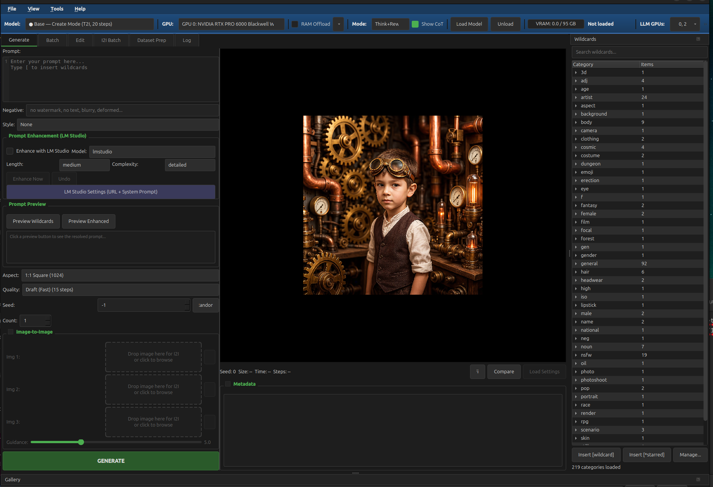

# Automatic1112

> **Status: Beta** -- Actively developed. Things may break, features may shift. That's half the fun.



## What is this?

If you were around for the AI art explosion of 2022-2023, you probably remember [AUTOMATIC1111](https://github.com/AUTOMATIC1111/stable-diffusion-webui). It was *the* tool -- the one that turned Stable Diffusion from a command-line curiosity into something anyone could use. 162k stars. 30k forks. A community that built an entire ecosystem of extensions, models, and workflows around it. It was glorious.

But the world moved on. Models got bigger -- *way* bigger. We went from 1B-parameter Stable Diffusion to 80B-parameter monsters like Tencent's HunyuanImage-3.0, which needs 93GB of VRAM just to sneeze. The old tools weren't built for this. You can't just `pip install` your way into running a model that needs two GPUs duct-taped together to fit in memory.

**Automatic1112** picks up where A1111 left off. Same spirit -- a local-first, no-cloud-needed desktop app that puts you in control of image generation. But rebuilt from scratch for the new generation of models:

- Native **dual-GPU support** that automatically splits 80B models across your cards
- A real **desktop app** (PySide6), not a browser tab pretending to be one
- **LLM-powered prompt enhancement** that runs on a separate machine so your GPU stays free for what matters
- Built to be **model-agnostic** -- HunyuanImage-3.0 is first, but the architecture is ready for whatever comes next
- **Cross-platform** -- Linux today, Windows support in progress

This isn't a fork of A1111. It's a love letter to it.

## Features

- **Text-to-Image** generation with multiple model variants (SDNQ uint4, NF4, Distil)
- **Image-to-Image** editing and transformation
- **Batch generation** with progress tracking, wildcards, and prompt templates
- **LLM prompt enhancement** via LM Studio or Ollama (keeps your GPU VRAM free)
- **Think/Recaption modes** for chain-of-thought reasoning before generation
- **Dual-GPU support** -- split massive models across two GPUs automatically
- **Dataset preparation** tools for training workflows
- **Dark theme** desktop UI with real-time GPU/VRAM monitoring
- **Headless CLI** for scripted and batch workflows
- **Wildcard system** for dynamic prompt templating

## Supported Models

Currently shipping with HunyuanImage-3.0 support. More model backends are planned.

| Model | Type | VRAM | Steps | Notes |
|-------|------|------|-------|-------|
| **SDNQ uint4** (dual-GPU) | | | | |
| HunyuanImage-3.0 Base | T2I | ~93GB peak | 20 | Fastest, text-to-image only |
| HunyuanImage-3.0 Instruct | T2I + I2I | ~93GB peak | 50 | Full feature set |
| HunyuanImage-3.0 Distil | T2I + I2I | ~93GB peak | 8 | Fast distilled variant |
| **INT8** (Blackwell-optimized) | | | | [jamesw767 on HF](https://huggingface.co/jamesw767) |
| HunyuanImage-3.0 Base INT8 | T2I | ~83GB | 20 | Single Blackwell GPU |
| HunyuanImage-3.0 Instruct INT8 | T2I + I2I | ~83GB | 50 | Single Blackwell GPU |
| HunyuanImage-3.0 Distil INT8 | T2I + I2I | ~83GB | 8 | Single Blackwell GPU, fast |
| **NF4** (single GPU) | | | | |
| HunyuanImage-3.0 Instruct NF4 | T2I + I2I | ~48GB | 50 | Most accessible |
| HunyuanImage-3.0 Distil NF4 | T2I + I2I | ~48GB | 8 | Single GPU, fast |

## Hardware Requirements

These are big models. There's no getting around that.

### Minimum (NF4 quantized models)
- 1x GPU with **48GB+ VRAM** (e.g., RTX A6000, RTX 6000 Ada)
- 32GB system RAM
- ~50GB disk space per model

### Recommended (SDNQ models, dual-GPU)
- 1x large GPU (**80GB+**) for transformer/MoE layers (e.g., RTX PRO 6000 Blackwell 96GB)
- 1x secondary GPU (**16GB+**) for VAE and vision model (e.g., RTX 5090 32GB)
- 64GB system RAM
- ~150GB disk space for models

### Why so much VRAM?
The quantized weights are ~48GB, but the 80B model uses Mixture-of-Experts with 64 experts per layer. During each diffusion step, the gating function creates a ~35GB activation spike. That's just how MoE works at this scale. See [SETUP.md](SETUP.md) for the full technical breakdown.

## Installation

### 1. Clone the repository

```bash
git clone https://github.com/TronMetatron/automatic1112.git
cd automatic1112
```

### 2. Install system dependencies

**Linux (Ubuntu/Debian):**
```bash
sudo apt install -y python3.12-venv python3.12-dev libxcb-cursor0
```

**Windows:**
- Install [Python 3.12](https://www.python.org/downloads/)
- Install [CUDA Toolkit 12.8](https://developer.nvidia.com/cuda-downloads)

### 3. Create Python environment

```bash
python3 -m venv venv
source venv/bin/activate   # Linux
# venv\Scripts\activate    # Windows
```

### 4. Install PyTorch with CUDA

```bash
pip install torch==2.7.1 torchvision==0.22.1 torchaudio==2.7.1 \
    --index-url https://download.pytorch.org/whl/cu128
```

### 5. Install dependencies

```bash
pip install -r requirements.txt
```

> **Important**: This project requires `transformers==4.57.3`. Newer versions (5.x) have incompatible Cache API changes that will break things.

### 6. Download models

Set your model directory (default: `~/automatic1112_models`):

```bash
export A1112_MODEL_DIR="$HOME/automatic1112_models"  # Linux
# set A1112_MODEL_DIR=%USERPROFILE%\automatic1112_models  # Windows
```

Download from HuggingFace -- pick the quantization that fits your GPU:

```bash
# INT8 models (Blackwell-optimized, single GPU ~83GB VRAM -- by jamesw767)
huggingface-cli download jamesw767/HunyuanImage-3-Instruct-Distil-INT8 \
    --local-dir "$A1112_MODEL_DIR/HunyuanImage-3-Instruct-Distil-INT8"

huggingface-cli download jamesw767/HunyuanImage-3-Instruct-INT8 \
    --local-dir "$A1112_MODEL_DIR/HunyuanImage-3-Instruct-INT8"

huggingface-cli download jamesw767/HunyuanImage-3-Base-INT8 \
    --local-dir "$A1112_MODEL_DIR/HunyuanImage-3-Base-INT8"

# NF4 models (single GPU, ~48GB VRAM)
huggingface-cli download Disty0/HunyuanImage3-Instruct-NF4-v2 \
    --local-dir "$A1112_MODEL_DIR/HunyuanImage3-Instruct-NF4-v2"

# SDNQ models (dual-GPU setups, ~93GB peak VRAM, best quality)
huggingface-cli download Disty0/HunyuanImage3-Instruct-SDNQ \
    --local-dir "$A1112_MODEL_DIR/HunyuanImage3-Instruct-SDNQ"
```

See [SETUP.md](SETUP.md) for all model variants and dual-GPU patch instructions.

### 7. Launch

**Linux:**
```bash
./launch_desktop.sh
```

**Windows:**
```cmd
launch_desktop.bat
```

## Configuration

### Environment Variables

| Variable | Default | Description |
|----------|---------|-------------|
| `A1112_MODEL_DIR` | `~/automatic1112_models` | Directory containing downloaded model weights |
| `A1112_VENV_PATH` | Auto-detected | Path to Python virtual environment |
| `A1112_LMSTUDIO_URL` | `http://localhost:1234` | LM Studio server URL for prompt enhancement |
| `CUDA_VISIBLE_DEVICES` | `0,1` | GPUs to use |
| `HF_HUB_OFFLINE` | `0` | Set to `1` to prevent HuggingFace network calls |

### Prompt Enhancement

The app can use **LM Studio** or **Ollama** running on any machine to enhance your prompts with an LLM before sending them to the image model. This keeps your GPU VRAM free for generation. Configure the URL in the app's settings panel or via `A1112_LMSTUDIO_URL`.

## CLI Usage

```bash
# List available models
./hunyuan_cli.sh list-models

# Generate with CLI
./hunyuan_cli.sh i2i --model distil --prompt "Watercolor painting" --image input.png
```

## Project Structure

```
automatic1112/
├── launch_desktop.sh / .bat   # Platform launchers
├── hunyuan_cli.sh / .bat      # CLI launchers
├── requirements.txt           # Python dependencies
├── hunyuan_desktop/           # Main application package
│   ├── main.py                # GUI entry point
│   ├── cli.py                 # Headless CLI
│   ├── core/                  # Model management, workers, settings
│   ├── widgets/               # PySide6 UI components
│   ├── models/                # Data models
│   ├── dialogs/               # Modal dialogs
│   └── theme/                 # Dark theme
├── ui/                        # Constants, presets, app state
├── patches/                   # Dual-GPU compatibility patches
├── ollama_prompts.py          # LLM prompt enhancement
├── lmstudio_client.py         # LM Studio API client
└── wildcard_utils.py          # Wildcard template system
```

## Roadmap

- [ ] Additional model backends (Flux, Stable Diffusion 3.5, etc.)
- [ ] LoRA/adapter support
- [ ] Extension/plugin system
- [ ] Inpainting and outpainting tools
- [ ] Full Windows support
- [ ] Model download manager built into the UI

## Credits

- [HunyuanImage-3.0](https://github.com/Tencent/HunyuanImage) by Tencent
- [INT8 Blackwell-optimized quantizations](https://huggingface.co/jamesw767) by jamesw767
- [SDNQ quantization](https://huggingface.co/Disty0) by Disty0
- Inspired by [AUTOMATIC1111/stable-diffusion-webui](https://github.com/AUTOMATIC1111/stable-diffusion-webui) -- the OG, the legend, the 162k-star giant whose shoulders we stand on

## License

[Apache License 2.0](LICENSE)
